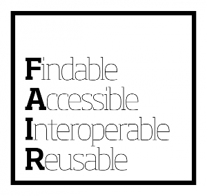

##Aim of Open Research Data workshops
- Understand the value of research data curation
- Educate good routines in Research Data Management
- Help researchers find their way in how to share and archive their research data

##Define what we mean by:
- Research Data - Good summaries from [Boston University](http://www.bu.edu/datamanagement/background/whatisdata/), [The Australian National Data Service](http://www.ands.org.au/guides/what-is-research-data)
- Sharing Research Data - In the context of Open Research Data, sharing research data is the long term preservation of data so it can be reused by other researchers also after several years.

##Why do we need Good Research Data Management and why should we share Research Data
- [Advertisement video from DCC on Managing Research Data and why to do this](http://www.dcc.ac.uk/news/managing-research-data-video)
- To summarize the video:
  - Risk of Data loss
  - Institutional reputation risk
  - Funder requirements
  - More credit/impact for the researcher
  - Verification of the research
  - Publicly paid research should be available for the public
- To do
  - [ ] Develop exerises
    - Group discussion on the positive and negative sides of Research Data Management and Research Data Sharing.

##Data Life Cycle 
e.g. this simple graphical expression [from Lancaster University](http://www.lancaster.ac.uk/library/rdm/what-is-rdm/plan/data-lifecycle/)

##Half Day workshop on creating Data Management Plans
- What is a Research Data Management Plan and why should I make one
- How to create proper data management plans
- Which tools to use to generate online Data Management Plans. Examples, [DMPonline tool](https://dmponline.dcc.ac.uk/) from the DCC and the [DMPTool](https://dmp.cdlib.org/) from the University of California
- To do
  - [ ] Develop exercises 
    - Prepare a simple project for which the participants need to make a DMP. In first instance, just as a flat document. After introducing the DMPonline tool, let them create a DMP online for the same project

##Half Day workshop on good Data Management?
Why is it necessary to manage your data properly? What should you think about when working with research data
- Data Structure (Example from this [Computational Biology paper](http://journals.plos.org/ploscompbiol/article?id=10.1371/journal.pcbi.1000424))
- Folder/file naming ([Stanford University Libraries](https://library.stanford.edu/research/data-management-services/data-best-practices/best-practices-file-naming), [University of Edinburgh](http://www.ed.ac.uk/records-management/records-management/staff-guidance/electronic-records/naming-conventions)
- Metadata and documentation ([Disciplinary metadata standards](http://www.dcc.ac.uk/drupal/resources/metadata-standards), [Metadata and documentation UCD Library)](http://libguides.ucd.ie/data/doc_metadata), [Introduction to Metadata from EUDAT](http://www.slideshare.net/EUDAT/introduction-to-metadata-57336324))
- File formats ([Stanford University Libraries](https://library.stanford.edu/research/data-management-services/data-best-practices/best-practices-file-formats), [University of Oregon](https://library.uoregon.edu/datamanagement/fileformats.html))
- Version Control. What should be under Version Control and what not. Learning version control follow SWC courses
- To do:
  - [ ] Develop exercises
   - Data Structure: Let them make a data structure for the same project
   - Folder/File naming: Let them agree on a general, common folder/file naming convention for the entire project
   - Metadata/Documentation: let them find useful data on the internet, document it and let them evaluate the metadata of the data det found
   - File formats: Which file formats should be used during the research and which should be used for archiving. Change of format required?
   - Make a overview of what should be under version control

##Half Day workshop on Archiving Data
- The archived data set should be useful for others to use. How to make a data set valid for archiving using the [FAIR principles](https://www.force11.org/group/fairgroup/fairprinciples)

- Which archives to use (http://www.re3data.org/ https://archive.norstore.no/ https://www.eudat.eu/)
- To do
  - [ ] Develop exercises
    - Same project, buit adjusted with some results. Prepare the project data set for archiving.
    - Archive the project data set

##Licensing Research Data 
- Sharing data should be credited and not due for misuse. By licensing the data these requirements can be acieved. The [Creative Commons licenses](https://creativecommons.org) have different license types that accomodates for different types of data. There is also a [norwegian site](https://creativecommons.no) for the Creative Commons licenses. There also exist specific Open Source licenses for software (e.g. the [GNU General Public License](https://www.gnu.org/licenses/gpl-3.0.en.html).

Use [mentimeter.com](http://www.mentimeter.com) for interactive use?

Need some feedback @arnsteio @annefou
